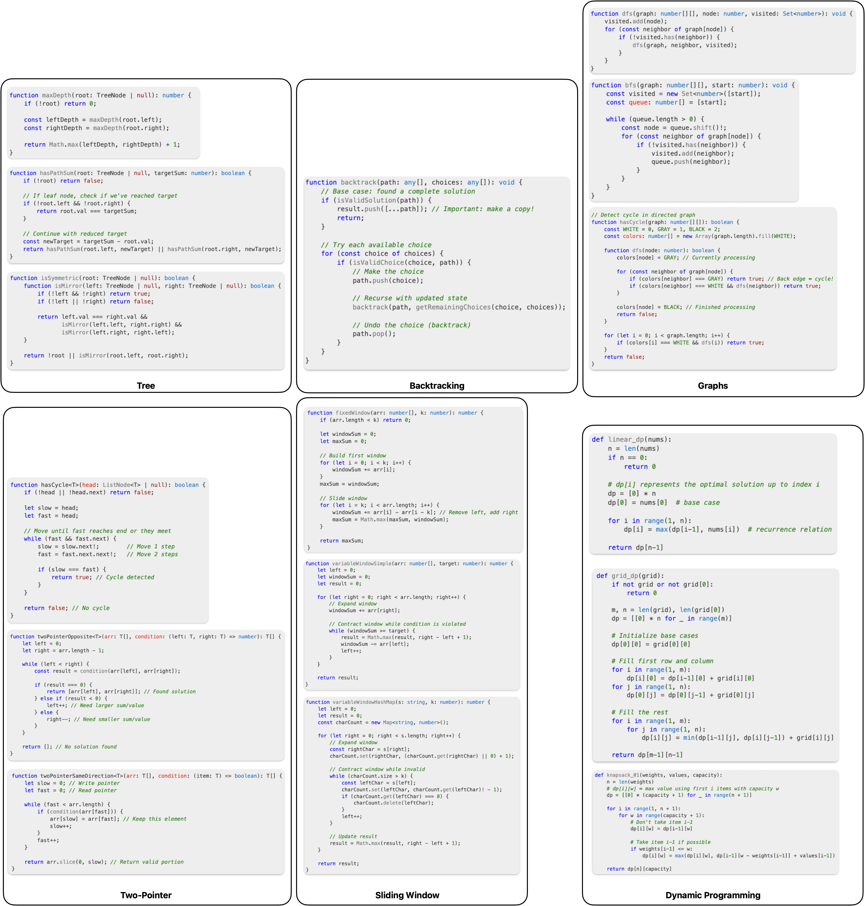

# Leetcode Labs

Labwork designed to help experienced developers consistently solve medium- and hard-Leetcode problems.

- [**Generating New Problems**](#generating-new-problems)
- [**Getting Started**](#getting-started)
- [**Coursework**](#coursework)
  - [**Preparation**](#preparation)
  - [**Algorithms**](#algorithms)
  - [**System Design**](#system-design)
- [**Resources**](#resources)
  - [**Reference Materials**](#reference-materials)
  - [**Core Algorithm Patterns**](#core-algorithm-patterns)
  - [**Data Structure Patterns**](#data-structure-patterns)
  - [**Advanced Techniques**](#advanced-techniques)
- [**Trivia**](#trivia)

## Generating New Problems

Put notebook info in `bin\notebook.yaml` file.

```console
deno task notebook (or notebook:override)
```

## Getting Started

1. **Assess your current level** using problems from the [ROI guide](./coursework/roi.md)
2. **Choose appropriate study plan** based on [algorithms](#algorithms) or [system design](#system-design)
3. **Set up your environment** with preferred IDE and timer
4. **Follow the daily schedule** consistently
5. **Use reference materials** for quick lookup during practice
6. **Track progress** using the success metrics provided

## Coursework

### Preparation



### 1. [Two Pointers](patterns/two-pointer.md#template-patterns)

- **When to use**: Sorted arrays, palindromes, target sum problems
- **Variations**: Same direction, opposite direction, fast/slow
- **Template**: Start with pointers, move based on comparison logic

### 2. [Sliding Window](patterns/sliding-window.md#template-patterns)

- **When to use**: Substring/subarray problems with constraints
- **Variations**: Fixed size, variable size, character frequency
- **Template**: Expand until invalid, then contract until valid

### 3. [Dynamic Programming](patterns/dynamic-programming.md#common-pattern-templates)

- **Identify**: Optimal substructure + overlapping subproblems
- **Approach**: Define state → find recurrence → implement
- **Common patterns**: Linear DP, 2D DP, sequence DP

### 4. [Graph Algorithms](patterns/graphs.md#common-leetcode-patterns)

- **DFS**: Path finding, backtracking, connected components
- **BFS**: Shortest path, level-order traversal
- **Key**: Choose based on problem requirements

### 5. [Backtracking](patterns/backtracking.md#the-backtracking-template)

- **When to use**: Generate all combinations/permutations
  - When the order doesn't matter, it is a _combination_
  - When the order does matter it is a _permutation_
- **Template**: Make choice → recurse → undo choice
- **Optimization**: Early pruning for efficiency

### 6. [Tree Algorithms](patterns/binary-trees.md#common-patterns-and-techniques)

- **Patterns**: Tree DP, serialization, construction
- **Key techniques**: Global vs local optimization
- **Applications**: Path problems, structure problems

### Algorithms

| Plan                                                                   | Duration | Target Audience    | Coverage         | Description                                                                                                                              |
| ---------------------------------------------------------------------- | -------- | ------------------ | ---------------- | ---------------------------------------------------------------------------------------------------------------------------------------- |
| [**3-Day Algorithm Fundamentals**](coursework/3-day-foundation.md)     | 3 days   | Medium level       | 85% of patterns  | Extended foundation building with 28 problems covering arrays, DP, graphs, backtracking, trees, and advanced data structures.            |
| [**21-Day Medium/Hard Progression**](coursework/21-day-medium+hard.md) | 21 days  | Medium to Advanced | 75-80% coverage  | Progressive difficulty increase focusing on deep pattern understanding rather than problem volume. Ideal for the medium→hard transition. |
| [**21-Day Hard Progression**](coursework/21-day-hard.md)               | 21 days  | Senior Engineers   | 90%+ of patterns | Advanced preparation for elite companies with 6 hours daily commitment. Includes competitive programming and system design integration.  |

### System Design

| Plan                                                               | Duration | Target Audience            | Coverage                | Description                                                                                                                                               |
| ------------------------------------------------------------------ | -------- | -------------------------- | ----------------------- | --------------------------------------------------------------------------------------------------------------------------------------------------------- |
| [**3-Day System Design Fundamentals**](coursework/3-day-system.md) | 3 days   | Algorithm-strong engineers | Interview essentials    | Core concepts, 6 case studies, and mock interviews. Covers scalability, databases, caching, and communication patterns for immediate interview readiness. |
| [**21-Day System Design Mastery**](coursework/21-day-system.md)    | 21 days  | Senior+ engineers          | Comprehensive expertise | Advanced architecture skills for Staff+ roles. Covers distributed systems, specialized domains (fintech, gaming, ML), and company-specific preparation.   |

## Resources

### Reference Materials

| Resource                                                     | Type                   | Purpose          | Description                                                                                                                                              |
| ------------------------------------------------------------ | ---------------------- | ---------------- | -------------------------------------------------------------------------------------------------------------------------------------------------------- |
| [**ROI Analysis**](coursework/roi.md)                        | Problem Prioritization | Study Efficiency | Problems categorized by return on investment based on AlgoMonster's analysis - which patterns give the highest interview success rate for time invested. |
| [**Algorithm Templates**](coursework/algorithm-templates.md) | Code Templates         | Implementation   | Ready-to-use code templates for all major patterns including two pointers, sliding window, DFS/BFS, DP, and more.                                        |

### Core Algorithm Patterns

| Pattern                                                    | Key Applications                        | When to Use                                    |
| ---------------------------------------------------------- | --------------------------------------- | ---------------------------------------------- |
| [**Two Pointers**](patterns/two-pointer.md)                | Sorted arrays, palindromes, target sums | Problems involving pairs or triplets in arrays |
| [**Sliding Window**](patterns/sliding-window.md)           | Substring/subarray optimization         | Contiguous sequence problems with constraints  |
| [**Backtracking**](patterns/backtracking.md)               | Permutations, combinations, puzzles     | Generate all possible solutions                |
| [**Dynamic Programming**](patterns/dynamic-programming.md) | Optimization problems                   | Optimal substructure + overlapping subproblems |
| [**Graphs**](patterns/graphs.md)                           | DFS, BFS, connectivity                  | Node/edge relationship problems                |
| [**Monotonic Stack**](patterns/montonic-stack.md)          | Next greater/smaller elements           | Stack-based optimization problems              |

### Data Structure Patterns

| Pattern                                         | Key Applications                | When to Use                       |
| ----------------------------------------------- | ------------------------------- | --------------------------------- |
| [**Binary Trees**](patterns/binary-trees.md)    | Tree traversal, path problems   | Hierarchical data structures      |
| [**Linked Lists**](patterns/linked-list.md)     | Pointer manipulation, cycles    | Sequential data with dynamic size |
| [**Heap**](patterns/heap.md)                    | Priority queues, top-k problems | Need min/max elements efficiently |
| [**Disjoint Sets**](patterns/disjoinit-sets.md) | Union-Find, connectivity        | Dynamic connectivity queries      |

### Advanced Techniques

| Pattern                                                       | Key Applications                     | When to Use                             |
| ------------------------------------------------------------- | ------------------------------------ | --------------------------------------- |
| [**Topological Sorting**](patterns/topological-sorting.ipynb) | Dependency resolution, scheduling    | Directed acyclic graph ordering         |
| [**Greedy Algorithm**](patterns/greedy-algorithm.md)          | Optimization with local choices      | Optimal substructure with greedy choice |
| [**Recursion**](patterns/recursion.md)                        | Divide and conquer, tree problems    | Self-similar subproblems                |
| [**Combinatorics**](patterns/combinatorics.md)                | Counting problems, probability       | Mathematical counting and arrangements  |
| [**Prefix/Suffix Arrays**](patterns/prefix_suffix_array.md)   | Range queries, cumulative operations | Efficient range sum/product queries     |

## Trivia

If you [interested](./coursework/trivia.md) on how these algorithms and data structures developed.
